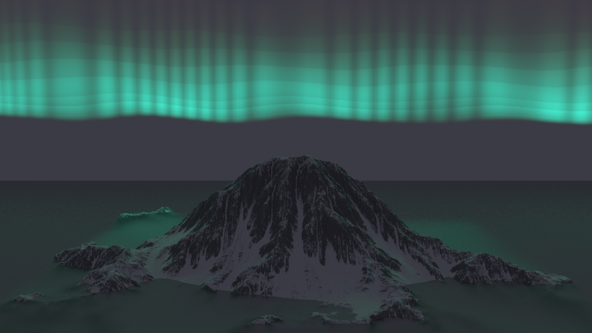

# Aurora-Rendering-Mitsuba3
Aurora Borealis rendered using Mitsuba 3

There are 3 scripts to run in order:
1. footprint.py to generate footprint
2. aurora_volume.py to create the volume grid
3. build_scene.py for final image

